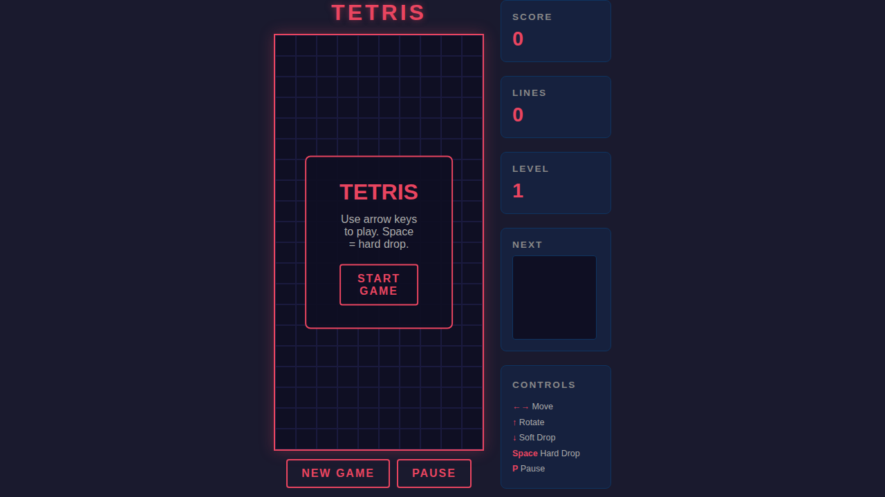
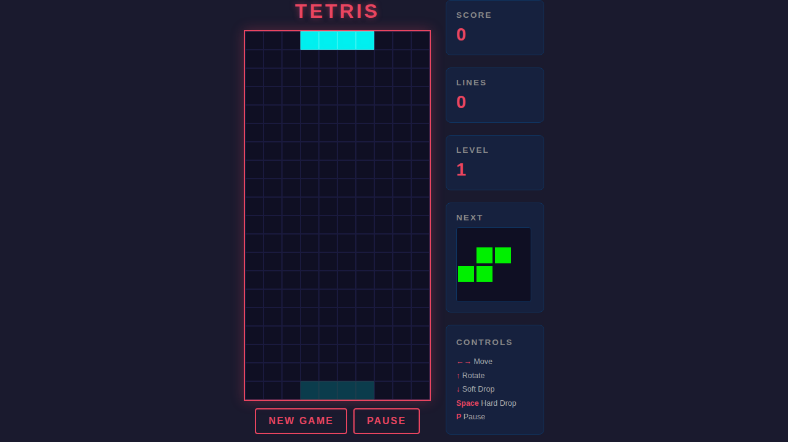
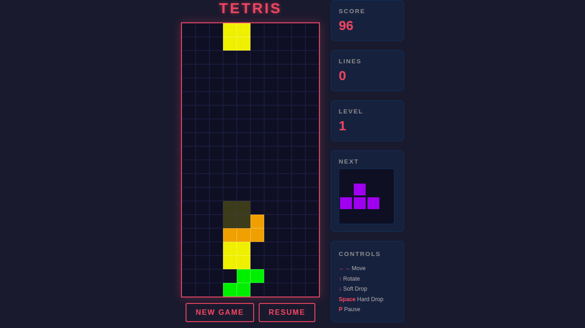

# Tetris — Browser Game

A fully-featured, zero-dependency Tetris game that runs entirely in the browser
(plain HTML + CSS + JavaScript).  No build step required — just open `index.html`.

---

## Table of Contents

1. [Features](#features)
2. [Getting Started](#getting-started)
3. [Controls](#controls)
4. [Scoring](#scoring)
5. [Screenshots](#screenshots)
6. [Project Structure](#project-structure)
7. [Running the Tests](#running-the-tests)

---

## Features

- All 7 classic tetrominoes (I, O, T, S, Z, J, L) in their standard colours
- Ghost-piece preview showing where the active piece will land
- Next-piece canvas preview
- Soft drop, hard drop, and wall-kick rotation
- Score, lines cleared, and level tracking
- Increasing speed per level (every 10 lines)
- Pause / Resume support
- "Game Over" overlay with instant restart

---

## Getting Started

### Option A — Open directly in your browser

```bash
open index.html        # macOS
xdg-open index.html    # Linux
start index.html       # Windows
```

### Option B — Serve with a local HTTP server

```bash
npm install
npm run serve          # starts http-server on http://localhost:3000
```

Then navigate to `http://localhost:3000` in your browser.

---

## Controls

| Key | Action |
|-----|--------|
| ← / → | Move piece left / right |
| ↑ | Rotate piece clockwise |
| ↓ | Soft drop (one row) |
| Space | Hard drop (instant lock) |
| P | Pause / Resume |

Buttons **New Game** and **Pause** on screen provide mouse/touch equivalents.

---

## Scoring

| Lines cleared at once | Points (×level) |
|-----------------------|-----------------|
| 1 (Single) | 100 |
| 2 (Double) | 300 |
| 3 (Triple) | 500 |
| 4 (Tetris!) | 800 |

- Hard-drop bonus: **2 points** per row the piece is dropped.
- Level increases every **10 lines** cleared.
- Drop speed increases with each level.

---

## Screenshots

### Welcome Screen

The game launches with an overlay prompting the player to start.



---

### Active Game

A game in progress, showing the board, active piece, ghost piece, next-piece
preview, and score/lines/level counters.



---

### Paused Game

Pressing **P** or clicking **Pause** freezes all movement and displays a
"PAUSED" indicator.



---

## Project Structure

```
.
├── index.html          # Game UI markup
├── style.css           # All visual styles
├── game.js             # Tetris game logic
├── package.json        # Node.js project (Playwright dev-dependency)
├── playwright.config.js
├── tests/
│   └── tetris.spec.js  # 28 Playwright end-to-end tests
└── docs/
    ├── README.md        # This file
    └── screenshots/
        ├── 01-welcome.png
        ├── 02-active-game.png
        └── 03-paused.png
```

---

## Running the Tests

The test suite uses [Playwright](https://playwright.dev) and covers:

- Page load (title, board, overlays, UI elements)
- Starting a game (overlay dismissal, initial stats)
- Keyboard controls (left, right, down, rotate, hard-drop)
- Pause / Resume behaviour
- New Game reset (score, lines, level)
- Screenshot generation

### Setup

```bash
npm install
npx playwright install chromium
```

### Run all tests

```bash
npm test
# or
npx playwright test
```

### Run tests in headed mode (see the browser)

```bash
npm run test:headed
```

### View the HTML test report

```bash
npx playwright show-report
```

All 28 tests should pass in a single run.
