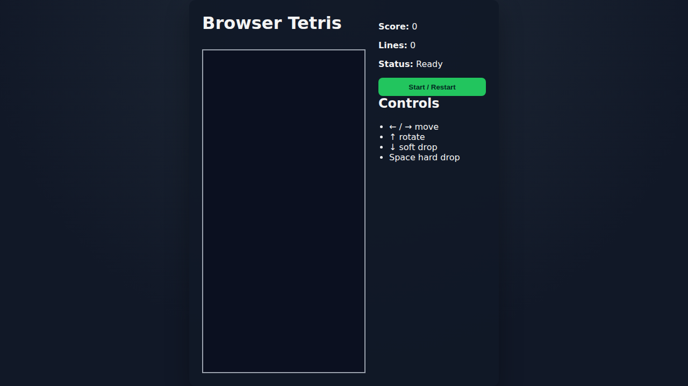

# Tetris Game Docs

## Overview

This project provides a playable Tetris game in the browser using plain HTML, CSS, and JavaScript.

## Controls

- Left Arrow: move left
- Right Arrow: move right
- Up Arrow: rotate
- Down Arrow: soft drop
- Space: hard drop

## Screenshot



## Test coverage (Playwright)

Playwright tests validate:

- App loads and starts correctly
- Keyboard movement works
- Hard drop settles blocks on the board

Run tests with:

```bash
npm test
```
